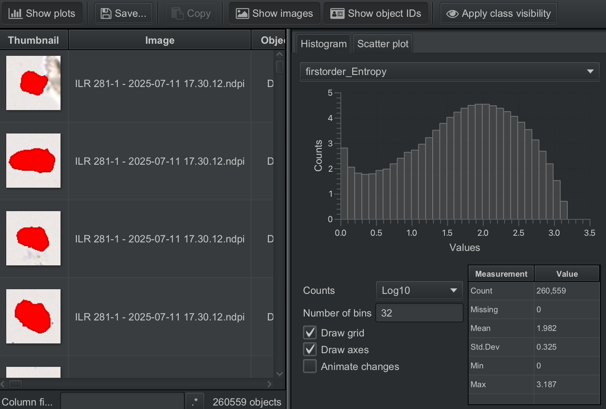

# Example Application

This guide walks through a complete radiomics workflow: from image with cell detections to feature extraction and visualization in QuPath.

## Overview

```
┌─────────────────┐    ┌─────────────────┐    ┌─────────────────┐
│  Image + Cells  │ -> │  Run QuRad      │ -> │  Visualize      │
│  in QuPath      │    │  Script         │    │  in QuPath      │
└─────────────────┘    └─────────────────┘    └─────────────────┘
```

## Step 1: Prepare Your Image

Start with an image in QuPath that has cell detections. These can come from:

- QuPath's built-in cell detection
- StarDist extension
- Cellpose extension
- Imported annotations (GeoJSON)

In this example, we use a mouse glioblastoma H&E image:


*Mouse glioblastoma H&E image loaded in QuPath.*

After running cell detection (using StarDist, Cellpose, or QuPath's built-in detection):


*Cell segmentations overlaid on the H&E image.*

### Importing External Annotations

If you have annotations from external tools:

1. Go to **File → Import objects**
2. Select your GeoJSON file
3. Annotations appear as detection objects

## Step 2: Run the QuRad Script

1. Open **Automate → Script editor**
2. Load `QuPath_Radiomics.groovy`
3. Configure settings if needed:

```groovy
def processDetections = true
def exportCSV = true
def addToMeasurements = true
```

4. Click **Run**

The script will process all cells and output:

```
================================================================================
QuPath Radiomics Extraction - v3
================================================================================
Processing 5000 objects

Processed 5000/5000 (892.3 objects/sec)

================================================================================
Complete
================================================================================
Processed: 5000 objects
Features per object: 120
```

## Step 3: Visualize in QuPath

### Measurement Maps

Color cells by any radiomics feature:

1. Go to **Measure → Show measurement maps**
2. Select a feature (e.g., `firstorder_Energy`)
3. Cells are colored by feature value


*Measurement map visualization: cells colored by `firstorder_Energy`. Dark violet indicates cells with lower energy values, yellow indicates cells with higher energy values.*

This helps identify spatial patterns in your data, such as:

- Regions with high texture complexity
- Clusters of cells with similar morphology
- Gradients across tissue regions

### Histogram View

View the distribution of any feature:

1. Open **Measure → Show measurement maps**
2. The histogram appears below the dropdown
3. Adjust the color scale with min/max sliders



*Histogram showing the distribution of `firstorder_Entropy` across all detected cells.*

## Step 4: Export Data

### CSV Export

The CSV file is automatically saved to your project's `radiomics` folder:

```
project/
└── radiomics/
    └── image_radiomics_20250126_143052.csv
```

The CSV contains:

- **120 radiomics features** per cell
- **ObjectID** - unique cell identifier
- **Classification** - cell class label
- **Centroid_X, Centroid_Y** - cell coordinates

### Export Measurements Table

You can also export via QuPath's built-in export:

1. Go to **Measure → Export measurements**
2. Select output format (CSV, TSV)
3. Choose which measurements to include

## Complete Workflow Summary

1. **Prepare**: Load image with cell detections in QuPath
2. **Extract**: Run QuRad script to compute 120 features per cell
3. **Visualize**: Use measurement maps to explore spatial patterns
4. **Compare**: View feature distributions across cell classes
5. **Export**: Save CSV for further analysis if needed
